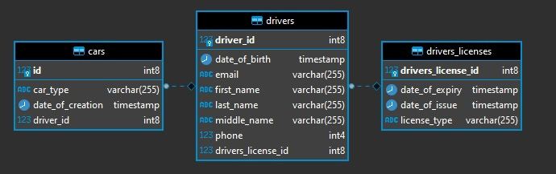

# Тестовое задание

## ERD Диаграмма Базы Данных

## Описание
Разработан микросервис для отдела логистики. Поддерживает CRUD операции для водителей и автомобилей. Миграции описаны с
помощью Liquibase.

## Запуск
Чтобы запустить приложение, перейдите в корневой каталог приложения и выполните в терминале команду: docker-compose up